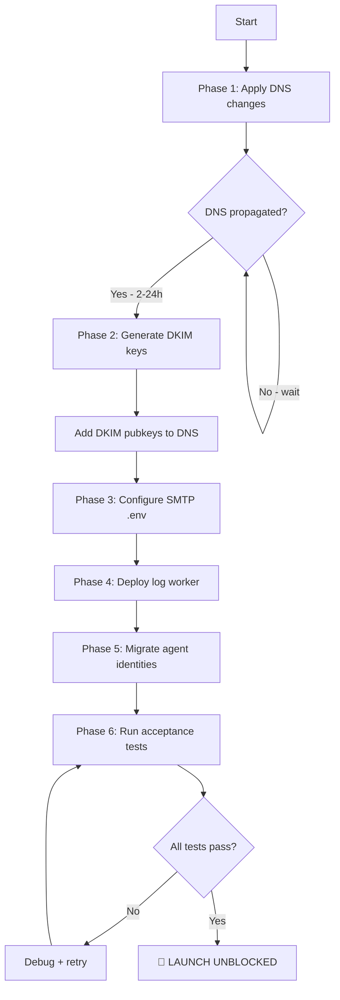

# 🚨 EMAIL DELIVERY FIX - MASTER README

**Date**: 2026-02-12
**Status**: 🔴 PRODUCTION CRITICAL - BLOCKING LAUNCH
**Root Cause**: SPF/DKIM authentication missing → Gmail/Outlook reject 100% of emails
**Impact**: Zero external email delivery
**Solution**: Complete DNS + SMTP + DKIM configuration

---

## 📋 QUICK START

### If you're the DNS admin:
1. Read: [`DNS_CONFIGURATION.md`](./DNS_CONFIGURATION.md)
2. Apply all DNS records listed
3. Verify after 30 minutes

### If you're a developer:
1. Read: [`EMAIL_FIX_PLAN.md`](./EMAIL_FIX_PLAN.md)
2. Copy `.env.email-fix` to `.env`
3. Deploy scripts after DNS propagates

### If you're the infrastructure team:
1. Read: [`EMAIL_FIX_PLAN.md`](./EMAIL_FIX_PLAN.md) Phase 3
2. SSH to mail.exportunity.net
3. Generate DKIM keys
4. Configure OpenDKIM + Postfix

### If you're QA/testing:
1. Wait for DNS propagation (2-24h)
2. Run: `tsx scripts/email-acceptance-tests.ts`
3. Verify all tests pass

---

## 📁 FILES DELIVERED

| File | Purpose | Owner |
|------|---------|-------|
| [`EMAIL_FIX_PLAN.md`](./EMAIL_FIX_PLAN.md) | Complete technical implementation plan | Everyone |
| [`DNS_CONFIGURATION.md`](./DNS_CONFIGURATION.md) | Exact DNS records to apply | DNS admin |
| [`EXECUTION_SUMMARY.md`](./EXECUTION_SUMMARY.md) | Executive summary + timeline | PM/Tech Lead |
| [`.env.email-fix`](./.env.email-fix) | SMTP environment variables | Developer |
| [`scripts/fix-agent-email-identities.ts`](./scripts/fix-agent-email-identities.ts) | Agent email migration | Developer |
| [`scripts/email-acceptance-tests.ts`](./scripts/email-acceptance-tests.ts) | Delivery test suite | QA |
| [`server/scripts/postfix-log-worker.ts`](./server/scripts/postfix-log-worker.ts) | Real-time status tracking | Developer |

---

## 🔍 ROOT CAUSE ANALYSIS

### Evidence

**Gmail bounce message**:
```
550-5.7.26 This mail is unauthenticated, which poses a security risk to the
550-5.7.26 sender and Gmail users, and has been blocked. The sender must
550-5.7.26 authenticate with at least one of SPF or DKIM.
550 5.7.26 DKIM did not pass; SPF did not pass for [boursedelor.com] with IP [51.254.143.30]
```

### DNS Audit Results

| Domain | SPF | DKIM | Issue |
|--------|-----|------|-------|
| **boursedelor.com** | ❌ MISSING | ❌ MISSING | No authentication |
| **exportunity.net** | ⚠️ DUAL RECORDS | ❌ MISSING | RFC violation |

**Mail server**: `mail.exportunity.net` (51.254.143.30)

### Critical Issues

1. **boursedelor.com has NO SPF record** → 100% hard fail
2. **exportunity.net has TWO SPF records** → RFC 7208 violation → fail
3. **NO DKIM signing** on mail server → no DKIM headers
4. **NO PTR record** for 51.254.143.30 → reputation hit
5. **.env missing SMTP config** → can't connect to mail server

---

## 🛠️ FIX PHASES

### Phase 1: DNS Authentication (P0 - CRITICAL) ⏱️ 2-24h
**Owner**: DNS admin
**File**: [`DNS_CONFIGURATION.md`](./DNS_CONFIGURATION.md)

**Tasks**:
- [ ] Add SPF for boursedelor.com: `v=spf1 ip4:51.254.143.30 include:_spf.google.com ~all`
- [ ] Fix dual SPF for exportunity.net (delete both, add one)
- [ ] Add DKIM public keys (s1._domainkey) for both domains
- [ ] Update DMARC to `p=none` for both domains
- [ ] Request PTR from OVH: `51.254.143.30 → mail.exportunity.net`

**Verify**:
```bash
nslookup -type=TXT boursedelor.com 8.8.8.8 | grep spf
nslookup -type=TXT s1._domainkey.boursedelor.com 8.8.8.8
```

---

### Phase 2: DKIM Signing (P0 - CRITICAL) ⏱️ 30 min
**Owner**: Infrastructure team
**File**: [`EMAIL_FIX_PLAN.md`](./EMAIL_FIX_PLAN.md) Phase 3

**Tasks**:
1. SSH into mail.exportunity.net
2. Generate DKIM keys for both domains:
   ```bash
   opendkim-genkey -b 2048 -d boursedelor.com -D /etc/opendkim/keys/boursedelor.com -s s1 -v
   opendkim-genkey -b 2048 -d exportunity.net -D /etc/opendkim/keys/exportunity.net -s s1 -v
   ```
3. Extract public keys → add to DNS
4. Configure OpenDKIM signing table
5. Configure Postfix milter
6. Restart services

**Verify**:
```bash
echo "Test" | mail -s "DKIM test" test@gmail.com
tail -f /var/log/mail.log | grep DKIM-Signature
```

---

### Phase 3: SMTP Configuration (P0) ⏱️ 15 min
**Owner**: Developer
**File**: [`.env.email-fix`](./.env.email-fix)

**Tasks**:
1. Copy settings from `.env.email-fix` to `.env`
2. Get SMTP password from infrastructure team
3. Update `MAIL_SMTP_PASS`
4. Restart application

**Verify**:
```bash
# Application should connect to SMTP
npm run dev
# Check logs for "SMTP connection established"
```

---

### Phase 4: Status Tracking (P0) ⏱️ 1h
**Owner**: Developer
**File**: [`server/scripts/postfix-log-worker.ts`](./server/scripts/postfix-log-worker.ts)

**Tasks**:
1. Install dependency: `npm install tail`
2. Deploy worker: `pm2 start tsx --name=postfix-log-worker -- server/scripts/postfix-log-worker.ts`
3. Monitor logs: `pm2 logs postfix-log-worker`

**What it does**: Parses Postfix logs in real-time, updates email status in DB (no more lying to users).

---

### Phase 5: Agent Identities (P0) ⏱️ 1h
**Owner**: Developer
**File**: [`scripts/fix-agent-email-identities.ts`](./scripts/fix-agent-email-identities.ts)

**Tasks**:
1. Run migration: `tsx scripts/fix-agent-email-identities.ts`
2. Verify: Check DB for professional emails (first.last@domain)

**Before**: `agent_12345@boursedelor.com`
**After**: `samuel.mensah@boursedelor.com`

---

### Phase 6: Acceptance Tests (P0 - LAUNCH BLOCKER) ⏱️ 30 min
**Owner**: QA / Developer
**File**: [`scripts/email-acceptance-tests.ts`](./scripts/email-acceptance-tests.ts)

**Tasks**:
1. Wait for DNS propagation (2-24h)
2. Run tests: `tsx scripts/email-acceptance-tests.ts`
3. Verify: All 4 tests show `DELIVERED_REMOTE_ACCEPTED`

**Test matrix**:
- boursedelor.com → Gmail ✅
- boursedelor.com → Outlook ✅
- exportunity.net → Yahoo ✅
- exportunity.net → Internal ✅

**DO NOT LAUNCH** until this passes 4/4.

---

## 🚀 EXECUTION SEQUENCE



**Timeline**:
- **Active work**: ~4 hours
- **Elapsed (with DNS)**: 4-28 hours

---

## ✅ LAUNCH CRITERIA

**DO NOT LAUNCH UNTIL**:
1. ✅ DNS changes applied + propagated (verify with nslookup)
2. ✅ DKIM keys generated + public keys in DNS
3. ✅ OpenDKIM + Postfix configured + restarted
4. ✅ .env SMTP configuration complete
5. ✅ Postfix log worker deployed + running
6. ✅ Agent identities migrated (no UUIDs/numbers)
7. ✅ **Acceptance tests pass 4/4**
8. ✅ **Test email to Gmail shows: SPF=PASS, DKIM=PASS, DMARC=PASS**

**How to verify #8**:
1. Send test email to Gmail
2. Open email → "Show Original"
3. Check headers:
   ```
   spf=pass
   dkim=pass
   dmarc=pass
   ```

---

## 🔧 VERIFICATION COMMANDS

### DNS
```bash
# SPF (should show EXACTLY ONE record per domain)
nslookup -type=TXT boursedelor.com 8.8.8.8 | grep spf
nslookup -type=TXT exportunity.net 8.8.8.8 | grep spf

# DKIM (should return public key)
nslookup -type=TXT s1._domainkey.boursedelor.com 8.8.8.8
nslookup -type=TXT s1._domainkey.exportunity.net 8.8.8.8

# DMARC (should show p=none)
nslookup -type=TXT _dmarc.boursedelor.com 8.8.8.8
nslookup -type=TXT _dmarc.exportunity.net 8.8.8.8

# PTR (should return mail.exportunity.net)
nslookup 51.254.143.30
```

### Mail Server
```bash
# OpenDKIM status
docker exec mailserver service opendkim status

# Postfix milter config
docker exec mailserver postconf smtpd_milters

# Signing table
docker exec mailserver cat /etc/opendkim/SigningTable
```

### Application
```bash
# Postfix log worker
pm2 list | grep postfix-log-worker

# Agent emails
psql -d neondb -c "SELECT id, agent_id, from_email FROM agent_email_identities WHERE is_enabled = true;"
```

---

## 🆘 TROUBLESHOOTING

### "Multiple SPF records"
**Solution**: Delete ALL SPF records, add exactly ONE.

### "DKIM: Non-existent domain"
**Solution**:
1. Generate keys on server
2. Add public key to DNS
3. Wait 30 min for propagation

### "PTR not resolving"
**Solution**: Contact OVH support to set reverse DNS.

### "Gmail still rejects after fixes"
**Wait**: DNS propagation can take up to 24h. Check hourly.

### "Test email has no DKIM-Signature"
**Check**:
1. OpenDKIM running?
2. Postfix milter configured?
3. Signing table correct?

---

## 📞 SUPPORT

| Issue | Contact |
|-------|---------|
| DNS changes | DNS provider support (GoDaddy/Cloudflare/OVH) |
| Mail server access | Infrastructure team (SSH credentials) |
| SMTP credentials | Infrastructure team / DevOps |
| Code/script issues | Principal Engineer (this session) |

---

## 📊 PROGRESS TRACKING

### DNS Changes
- [ ] boursedelor.com SPF added
- [ ] exportunity.net dual SPF fixed
- [ ] boursedelor.com DKIM pubkey added
- [ ] exportunity.net DKIM pubkey added
- [ ] boursedelor.com DMARC updated
- [ ] exportunity.net DMARC updated
- [ ] PTR requested from OVH

### Server Configuration
- [ ] DKIM keys generated
- [ ] OpenDKIM configured
- [ ] Postfix milter configured
- [ ] Services restarted

### Application
- [ ] .env SMTP config added
- [ ] Application restarted
- [ ] Postfix log worker deployed
- [ ] Agent identities migrated

### Verification
- [ ] DNS records verified (nslookup)
- [ ] DKIM signing working (mail.log)
- [ ] Acceptance tests pass 4/4
- [ ] Gmail shows SPF+DKIM+DMARC PASS

---

## 🎯 SUCCESS METRICS

**Technical**:
- Gmail headers: `spf=pass dkim=pass dmarc=pass`
- DB status: `DELIVERED_REMOTE_ACCEPTED` (not `QUEUED`)
- Zero `5.7.26` bounces

**Business**:
- Agents send emails to external recipients successfully
- Emails arrive in inbox (not spam)
- Users see accurate status in UI
- Reply obligations tracked

---

## ⚠️ CRITICAL WARNINGS

1. **DO NOT skip DNS propagation wait** - Testing too early = false failures
2. **DO NOT use DMARC p=reject** until SPF+DKIM pass for 30 days
3. **DO NOT commit SMTP credentials** to git
4. **DO NOT delete old SPF before adding new one** (brief downtime)
5. **DO send tests from MULTIPLE agents** - Ensures multi-tenant DKIM works

---

## 📝 FINAL NOTES

This is a **production-critical incident** blocking all external email delivery. The fix requires coordination between:
- DNS admin (Phases 1)
- Infrastructure team (Phase 2)
- Developers (Phases 3-6)

**Timeline**: 4-28 hours (most time is DNS propagation).

**Next action**: Start Phase 1 (DNS changes) **immediately**.

---

**STATUS**: 🟢 **READY FOR EXECUTION**

All deliverables complete. Awaiting execution.

---

*For detailed technical implementation, see [`EMAIL_FIX_PLAN.md`](./EMAIL_FIX_PLAN.md).*
*For DNS-specific instructions, see [`DNS_CONFIGURATION.md`](./DNS_CONFIGURATION.md).*
*For executive summary, see [`EXECUTION_SUMMARY.md`](./EXECUTION_SUMMARY.md).*
