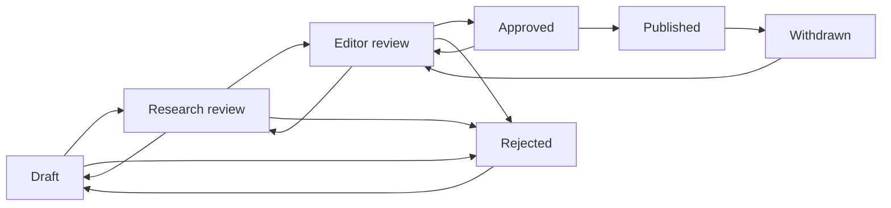

# Governed Trade Newsroom

**Status:** Implemented in source; migration, real evidence, and deployed verification remain open.
**Migration:** `20270411_exportunity_trade_newsroom.sql`

## Purpose

The newsroom converts reviewed trade research into original public reporting without creating a second truth system or allowing generated copy to publish itself. Articles remain tenant-scoped editorial records; every public citation points back to the existing source registry and can optionally reference a graph fact or immutable source snapshot.

No seed article, market claim, source, translation, crawler, social post, or external notification is created by this implementation.

## Canonical Records

| Record | Authority |
| --- | --- |
| `trade_newsroom_articles` | Current content, scope, editorial status, source counters, language/SEO metadata, and accountable authors/approvers/publishers. |
| `trade_newsroom_citations` | Precise URL, supported claim, short excerpt, registered source, optional fact/snapshot, evidence hash, and human verification decision. |
| `trade_newsroom_revisions` | Immutable versioned snapshots of every saved content revision. |
| `trade_newsroom_review_events` | Append-only editorial state changes with reason, checklist, actor, and time. |
| `industrial_audit_logs` | Cross-system audit record for creation, revision, citation, review, approval, publication, and withdrawal. |

## Editorial State Machine

Same-state updates and every transition not shown above are rejected server-side. Content and citation changes are locked in `approved` and `published`; an accountable editor must deliberately return the story to an editable review state.

## Approval and Publication Gate

Both approval and publication are refused unless all conditions are true:

- title has at least 12 characters;
- dek has at least 30 characters;
- body has at least 300 characters;
- original Exportunity analysis has at least 80 characters;
- at least two citations are attached and verified;
- verified citations use at least two distinct active registry sources;
- every attached citation is verified, with no pending, disputed, stale, or inactive evidence;
- every citation contains an HTTP(S) URL, source title, and precise supported claim;
- an authenticated accountable human explicitly confirms the checklist.

The service never performs an automatic transition to `published`. AI-assisted drafts must store generation provenance and enter the same workflow as human/imported drafts.

## Public Projection

The public endpoints are:

- `GET /api/trade/newsroom`
- `GET /api/trade/newsroom/:slug`

Only `published` articles are selected. The response contains only verified citations whose registered sources are currently `active`. A published article is withheld from the public response if fewer than two citations or fewer than two distinct active sources remain after that live filter. Private generation metadata, review notes, actors, revisions, and review events are never returned publicly.

The public hub links to `/trade/articles/:slug`, where readers can inspect original analysis, the evidence ledger, publication/retrieval dates, and any related graph entity that is independently verified and published.

## Staff Controls

The Trade Intelligence Command Center includes a Newsroom tab for:

- creating human-origin drafts and saving immutable revisions;
- attaching citations from active registered sources;
- verifying, disputing, or marking citations stale with written notes;
- seeing evidence and active-source counters;
- moving through legal editorial states with a reason and human confirmation;
- explicitly publishing or withdrawing an article.

These controls call server-side policy; the UI cannot bypass evidence, tenant, or transition checks.

## Release Checklist

1. Apply and verify migration `20270411` after the preceding trade-intelligence migrations.
2. Confirm all four tables, enum values, checks, unique indexes, and foreign keys.
3. In a non-production tenant, exercise draft, revision conflict, duplicate citation, cross-tenant reference rejection, citation decisions, invalid transition, approval refusal, publication, source deactivation, and withdrawal.
4. Verify drafts, private metadata, pending citations, and inactive-source articles never appear through public endpoints.
5. Onboard real sources and articles only through accountable editorial review. Do not fabricate a corpus for release testing.
6. Add translation review, structured data, media licensing, and content-to-conversion attribution as separate governed slices; none are implicitly enabled here.
